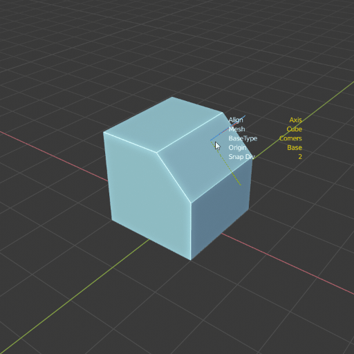
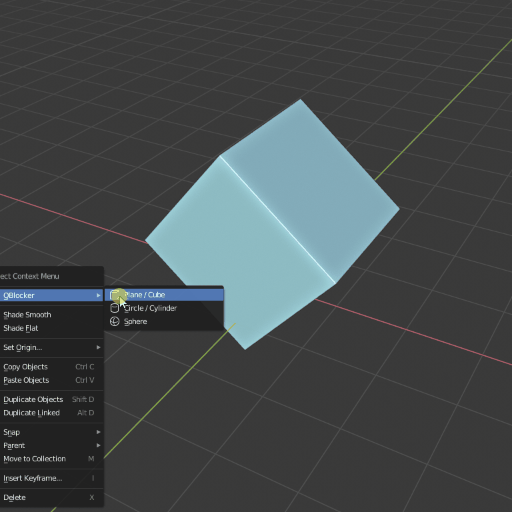
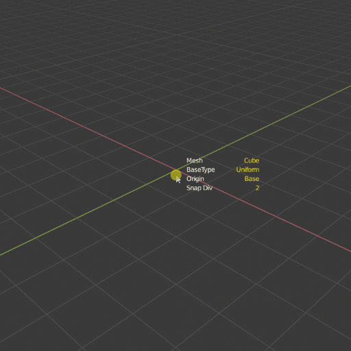
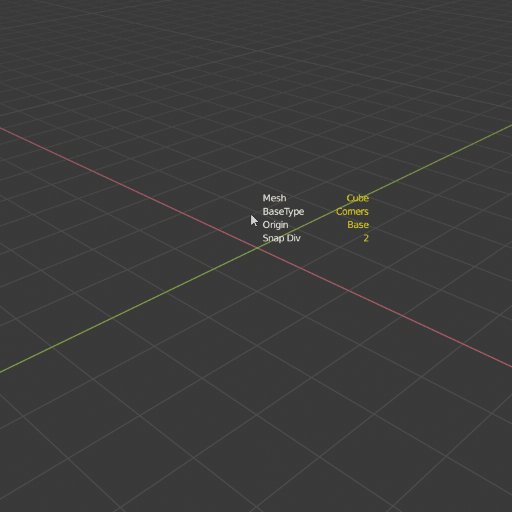
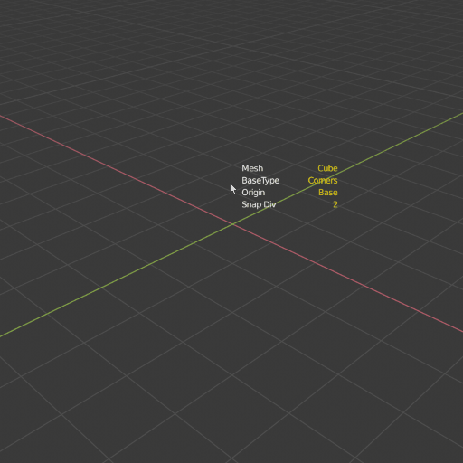
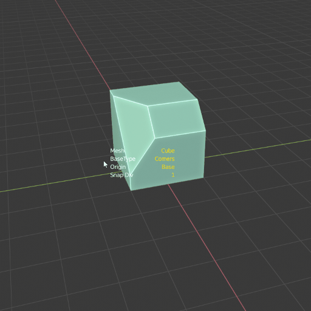
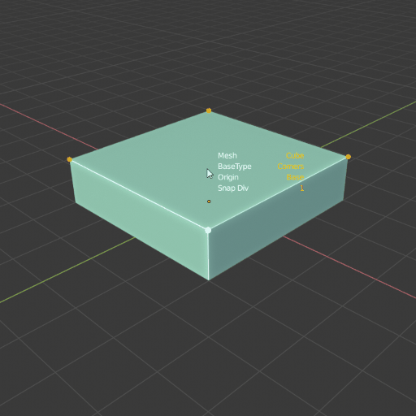
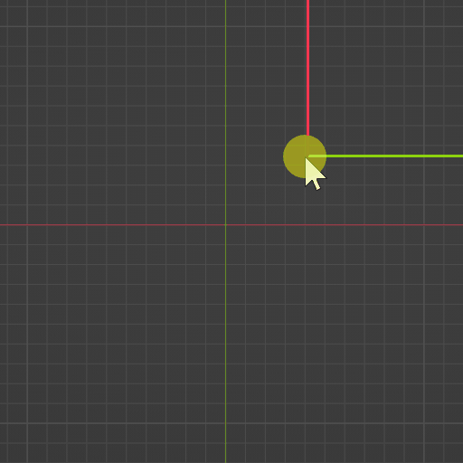
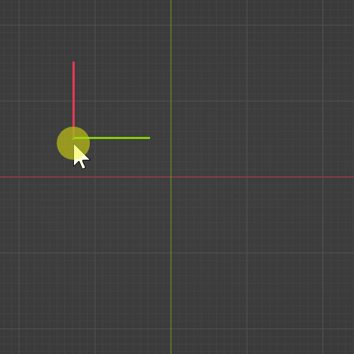
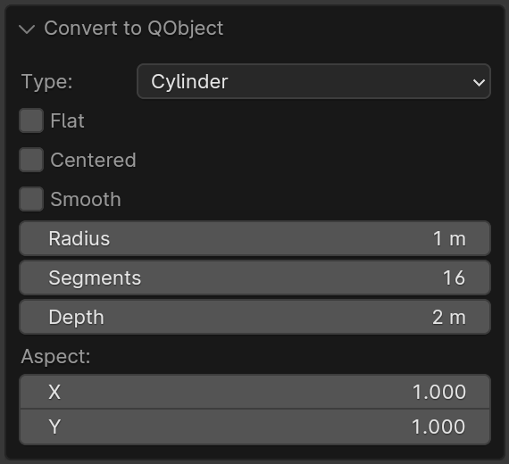

Qblocker 0.2.2
##############

.. toctree::
   :maxdepth: 1
   :caption: Changelog

   qblocker_changelog

Preferences
***********

General settings
================
* **Active mouse button:** Select your preferred mouse button.
* **Show hep text:** Turn off and on the help section.
* **Show parameters at cursor:** Turn off and on the tool settings.
* **Show orientation axis:** Hide axis from view when moving mouse.
* **UI scale:** Relative scale of the UI elements in the addon.
* **Help offset:** Change the gap between the help text and the edge of the viewport.
* **Colors:** All tool text-related colors.

RayCast settings
================
* **Hit settings:** Default value for hit filter.
* **Ignore Wire and Bounds objects:** Exclude object from the raycast if the viewport display is "Wire" or "Bounds".

Working Plane settings
======================
* **Grid lines color:** The color of the working plane grid.
* **X axis color:** The color of the X axis.
* **Y axis color:** The color of the y axis.
* **Fade distance:** The distance between the mouse position and the edge of the faded grid.
* **Line width:** The width of the grid lines.
* **Align 3D cursor:** Align the 3d cursor together with the Working Plane.

Snap Settings
=============
* **Turn off snapping in height stage:** When start to pull the object height, the snap will be turned off.
* **Snap Distance:** Set the minimum distance to snap a point.
* **Dot size factor:** The relative size of the default snap dot size.
* **Colors:** All the snap tool-related colors.

Object settings
===============
* **Default segments:** Set the segment count for cylinder and sphere.

Set Origin settings
===================
* **Colors:** Set the colors of the different elements of the tool.
* **Base line width:** Set the width of the line rectangle in the viewport.
* **Dot size factor:** The relative size of the dots.

Key settings (WIP)
==================
This section is in work in progress.

.. raw:: html

   

Where to find
*************
* View3D -> Add -> QBlocker
* Shift + A -> QBlocker

.. raw:: html

   

Working Plane
*************

Place Working Plane
===================

Hotkey: **W**

You can create an aligned working plane on the surface of the objects, and create new meshes on the grid.

* Lock working plane grid center to snap points.
* The plane data is saved for the addon, so creating new objects will recall the previous plane.
* The plane grid size matches the Blender original grid steps.
* The 3d cursor will be aligned to the WP center if it is set in the addon preferences.

.. image:: _static/gif_workingplane2.gif
   :width: 320px

Resize Working Plane
====================

Hotkey: **Hold CTRL + W**

When the working plane is active, hold Ctrl+W to set the grid size.
Work with the snapping tool too.

Reset the Working Plane size
============================

Hotkey: **Shift + W**

Press Shift+W to reset the working plane grid size to the default value.

.. raw:: html

   

Create Objects
**************

Object List:

* **Plane/Cube** : Simple cube and plane object.
* **Circle/Cylinder** : Simple Cylinder and Circle object.
* **Cone** : Same as the cylinder, but after setting the height, hold the mouse to set the top radius.
* **Tube** : Sam as the cylinder, but with thickness as the second radius.
* **Capsule** : Generic capsule object.
* **Sphere** : Simple Sphere.
* **SphereCube** : Spherical subdivided cube object with evenly distributed segments.
* **Pyramid** : Simple pyramid.
* **Linked** : Use the active object as the geometry for the tool.

Quick switch object type
========================

Hotkey: **1-5**

Switch the object type without stopping and start another operator.

1. Cube
2. Cylinder
3. Sphere
4. Cone
5. Tube

Orientation
===========

Hotkey: **Q**

You can change the axis alignment of the objects.

* **Axis align:** The object rotation is similar to the Blender original world rotation.
* **Oriented align:** If the target is an object, the rotation is calculated from the target polygon's smallest bounding box.

Hit filter
==========

Hotkey: **E**

* All: Hit the closest object or grid under the mouse.
* Front Grid: Hit surfaces only if it is in front of the grid.
* Grid Only: The grid surface only.

.. image:: _static/gif_ignore_grid.gif
   :width: 320px

.. note:: When the "Front Grid" filter is active, and the mesh surface lying on the grid, the tool will hit on the grid.

Base type
=========

Hotkey: **Hold CTRL, SHIFT, CTRL + SHIFT**

For all object types, there are four variations to lay down the base of the mesh:

* Corner to corner ( Default )
* Centered Rechtangle ( Ctrl )
* Centered Square ( Shift )
* Uniform All ( Ctrl + Shift )
* Place (Alt): Only works with the Linked objects. This will place the source one with the original scale.

.. image:: _static/gif_basetype_1.gif
   :width: 320px

.. image:: _static/gif_basetype_2.gif
   :width: 320px

.. image:: _static/gif_basetype_4.gif
   :width: 320px

Increment Height
================

Hotkey: **Hold Shift**

You can force the height value to increment by the grid step.

Origin position
===============

Hotkey: **O**

You can switch ground or centered origin on the fly.

.. image:: _static/gif_centered.gif
   :width: 320px

Flat Mesh variants
==================

Hotkey: **H**

In Cube and Cylinder operator you can switch the mesh to a flat variant.

* Plane <-> Cube
* Circle <-> Cylinder

Smooth Geometry
================

Hotkey: **D**

You can toggle the smoothness of some objects.

.. image:: _static/gif_smooth.gif
   :width: 320px

Change Segments
===============

Hotkeys:

* **Hold S + Mouse Wheel Up/Down** ,
* **Hold S + Mouse move left/right**

You can change the Cylinder/Circle and Sphere segments by holding the S key and:

* Move your mouse left and right.
* scroll with the mouse wheel.

.. image:: _static/gif_segments.gif
   :width: 320px

Vertices and Edges Snap
=======================

Hotkey: **Y, Z**

Calculate the snapable point on the polygon vertices and edges, based on the snap division.

Oriented Grid Snap
==================

Hotkeys: **X**

The oriented bounding box will calculate the smallest rotation so your polygon aligns perfectly with the surface.

Change Snap Subdivision
=======================

Hotkeys:

* **Hold C + Mouse Wheel Up/Down** ,
* **Hold C + Mouse move left/right**

You can change the subdivision for snapping:

* In simple snap it will multiply the snap points on the edges.
* With the oriented snap it will increase the subdivision of the grid.

.. raw:: html

   

Create Linked Object
********************

.. admonition:: v0.2

    A new operator was added to the right-click options menu.

.. attention:: If the origin of the source object is outside the mesh volume, the operator will fail to calculate the proper bounding box.

This operator uses the active object instead of the generated one.

Alternative Base types
======================

Hotkey: **A**

By default, the operator uses the alternative base types, but you can switch back to the original by pressing the **A** key.
With this mode, the new object will be rotated in the direction of the second point after clicking and holding the mouse button.

| **Origin to Point ( Default ):**
| The Object origin will be positioned at the first point, and scaled to reach the second one.
| **Between two Points ( Ctrl ):**
| The object will be placed between the two points.
| **Place( Shift ):**
| Place the object on the first point and rotate toward the second one. The size will match with the original one.

Change Axis
===========

Hotkey: **F**

You can change between X+ and Y+ axis to be the direction of the new meshes.

Linked or Copy
==============

Hotkey: **L**

Choose if the tool creates new mesh data for the objects, or links it to the source.

* Copy <-> Linked

.. raw:: html

   

Convert to QObject
******************

**Object Mode Context Menu -> Convert to QObject**

With this operator, you can turn any object into QObject.
The tool will calculate the mesh parameters from the source mesh volume.

.. raw:: html

   

Parametric Objects
******************

**Properties Panel-> Object Data-> QObject Properties**

After creating the QBlocker object, you can change the parameters and recalculate the mesh.

.. image:: _static/img_parametric.png
   :width: 328px

**Object Mode Context Menu -> QObject Properties**

.. admonition:: v0.2

    A new operator was added to the right-click options menu.

You can open a floating window to change the parameters of the QObject. Tweak the values will recreate the mesh data.

.. raw:: html

   

Slice parameter
***************

**Properties Panel-> Object Data-> QObject Properties**

The cylindrical object has an optional slice variant that can be set from the properties panel.

.. image:: _static/gif_slice.gif
   :width: 320px

.. raw:: html

   

Set QObject origin
******************

**Object Mode Context Menu -> QObject origin**

.. admonition:: v0.2

    A new operator was added to the right-click options menu.

QObjects have an offset value to generate the mesh relative to the object origin.
With this operator, you can place the origin at the corners or edge centers of the qobject.
The tool will set the offset and move the object location to compensate for the location shifting.
The operator calculates the targets from the bounding box for cubes, but the radius is used in cylindrical objects to maintain size and location when the segment count is changed.

.. warning:: The operator only takes into account the active object location. If the mesh data is linked, the location of related objects will change.

.. raw:: html

   

