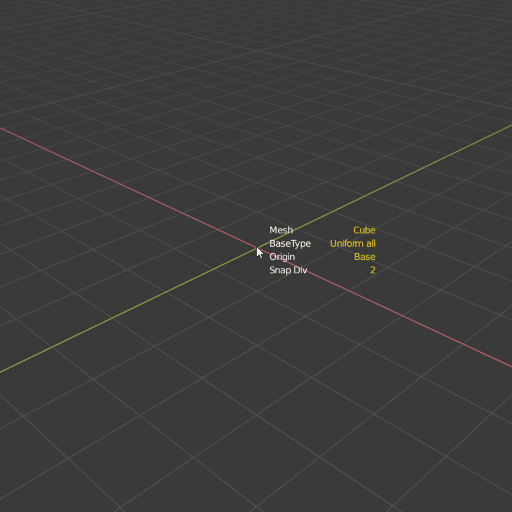
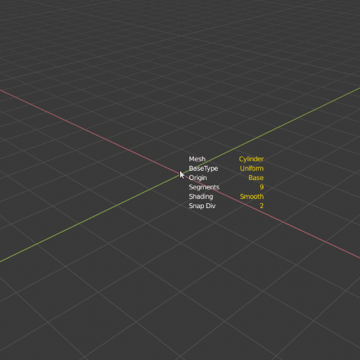

QBlocker free v0.1.61
#####################

Preferences
***********

General settings
================
* Active mouse button: Select your preferred mouse button.
* Show hep text: Turn off and on the help section.
* Show parameters at cursor: Turn off and on the tool settings.
* Show orientation axis: Hide axis from view when moving mouse.
* Hit settings: Default value for hit filter.
* Colors: All tool text-related colors.

RayCast settings
================
* Hit settings: Default value for hit filter.
* Ignore Wire and Bounds objects: Exclude object from the raycast if the viewport display is "Wire" or "Bounds".

Working Plane settings
======================
* Grid cell count: The number of grid cells drawn on view.
* Grid lines color: The color of the working plane grid.
* Align 3D cursor: Align the 3d cursor together with the Working Plane.

Snap Settings
=============
* Turn off snapping in height stage: When start to pull the object height, the snap will be turned off.
* Snap Distance: Set the minimum distance to snap a point.
* Dot size factor: The relative size of the default snap dot size.
* Colors: All the snap tool-related colors.

Object settings
===============
* Default segments: Set the segment count for cylinder and sphere.

.. raw:: html

   

Where to find
*************
* View3D -> Add -> QBlocker
* Shift + A -> QBlocker

.. raw:: html

   

Working Plane
*************

Place Working Plane
===================

Hotkey: **W**

You can create an aligned working plane on the surface of the objects, and create new meshes on the grid.

* Lock working plane grid center to snap points.
* The plane data is saved for the addon, so creating new objects will recall the previous plane.
* The plane grid size matches with the Blender original grid steps.

.. image:: _static/gif_workingplane1.gif
   :width: 320px

Resize Working Plane
====================

Hotkey: **Hold CTRL + W**

When the working plane is active, hold Ctrl+W to set the grid size.
Work with the snapping tool too.

Reset the Working Plane size
============================

Hotkey: **Shift + W**

Press Shift+W to reset the working plane grid size to the default value.

.. raw:: html

   

Create Objects
**************

Object List:

* **Plane/Cube** : Simple cube and plane object.
* **CornerCube** : Simple cube but the origin is positioned in the corner.
* **Circle/Cylinder** : Simple Cylinder and Circle object.
* **Sphere** : Simple Sphere.
* **SphereCube** : Spherical subdivided cube object with evenly distributed segments.

Orientation
===========

Hotkey: **Q**

You can change the alignment calculation of the objects.

* **Axis align:** The object rotation is similar to the blender's original world rotation.
* **Oriented align:** If the target is an object, the rotation is calculated from the target polygon's smallest bounding box.

.. image:: _static/gif_alignments.gif
   :width: 320px

Hit filter
==========

Hotkey: **E**

* All: Hit the closest object or grid under the mouse.
* Front Grid: Hit surfaces only if it is in front of the grid.
* Grid Only: The grid surface only.

.. image:: _static/gif_ignore_grid.gif
   :width: 320px

.. note:: When the Front Grid filter is active, and the mesh surface lying on the grid, the tool will calculate on the grid.

Base type
=========

Hotkey: **Hold CTRL, SHIFT, CTRL + SHIFT**

For all object types, there are four variations to lay down the base of the mesh:

* Corner to corner ( Default )
* Centered Rechtangle ( Ctrl )
* Centered Square ( Shift )
* Uniform All ( Ctrl + Shift )

.. image:: _static/gif_basetype_2.gif
   :width: 320px

.. image:: _static/gif_basetype_3.gif
   :width: 320px

.. note:: From 0.15 version the uniform all option will wait for one more mouse click to finish the operation. In this way, you can set the segments of objects before finalizing.

Increment Height
================

Hotkey: **Hold Shift**

You can force the height value to increment by the grid step.

.. image:: _static/gif_increment.gif
   :width: 320px

Origin position
===============

Hotkey: **O**

You can switch ground or centered origin on the fly.

.. image:: _static/gif_centered.gif
   :width: 320px

Mesh alternative
================

Hotkey: **H**

In Cube, CornerCube and Cylinder operator you can switch mesh type.

* Plane <-> Cube
* Corner Plane <-> CornerCube
* Circle <-> Cylinder 

.. image:: _static/gif_flat.gif
   :width: 320px

Smooth Geometry
===============

Hotkey: **D**

You can toggle the smoothness of the Cylinder and Sphere.

Change Segments
===============

Hotkeys:

* **Hold S + Mouse Wheel Up/Down** , 
* **Hold S + Mouse move left/right**

You can change the Cylinder/Circle and Sphere segments by holding the S key and:

* Move your mouse left and right.
* scroll with the mouse wheel.

Vertices and Edges Snap
=======================

Hotkey: **Y, Z**

Calculate the snapable point on the polygon vertices and edges, based on the snap division.

.. image:: _static/gif_snap_base.gif
   :width: 320px

Oriented Grid Snap
==================

Hotkeys: **X**

The oriented bounding box will calculate the smallest rotation so your polygon aligns perfectly with the surface.

.. image:: _static/gif_snap_orient.gif
   :width: 320px

Change Snap Subdivision
=======================

Hotkeys:

* **Hold C + Mouse Wheel Up/Down** , 
* **Hold C + Mouse move left/right**

You can change the subdivision for snapping:

* With a simple snap it will multiply the snap points on the edges.
* With oriented snap it will increase the subdivision of the grid.

.. image:: _static/gif_snap_segments.gif
   :width: 320px

.. raw:: html

   

Convert to QBlock
*****************

**Add -> Convert to QBlock**

With this tool, you can turn any object into QBlock. 
The tool will calculate the mesh parameters from the source mesh volume.

.. image:: _static/img_turnintoqblock.png
   :width: 282px

.. raw:: html

   

Parametric Objects
******************

**Properties Panel-> Object Data->QBlock Properties**

After creating the QBlocker object, you can change the parameters and regenerate the mesh.

.. image:: _static/img_parametric.png
   :width: 328px

.. note:: From 0.15 the Plane and Circle types are merged into the Box and Cylinder with the Flat parameter.

.. raw:: html

   

Changelog
*********

v0.1.61
=======

Improvements
~~~~~~~~~~~~
* Numpad keys are usable from the addon to change the camera view

Fixes
~~~~~
* -Y orthographic view crash
* Changing smoothing while creating objects crash

v0.1.6
======

Improvements
~~~~~~~~~~~~
* Ignore objects with wireframe or bound viewport display
* Hide the UI block next to the mouse cursor with F2
* 3D cursor set to the working plane center

Changes
~~~~~~~
* F1 and F2 keys change the addon preference values directly

Fixes
~~~~~
* Height increment with shift key can stuck
* Raycast can fail and crash the addon in some cases

v0.1.54
=======
Fixes
~~~~~
* Blender 4.1 compatibility fix.

Improvements
~~~~~~~~~~~~
* UV map channel created for objects

v0.1.53
=======
Fixes
~~~~~
* Blender 4.0 compatibility fix.

v0.1.51
=======
Fixes
~~~~~
* Fix inverted normals issue.
* Blender 2.91 compatibility fix.

v0.1.5
======
New features
~~~~~~~~~~~~
* Convert to qblock tool.
* Edit mode object creation.
* Sphere cube and Corner cube objects.
* Grid hit only option. **E**
* Change working plane size. **CTRL+W**
* Snapping turning off in height stage. (Can change in preferences.)

Improvements
~~~~~~~~~~~~
* Change mesh and snap segments with the same key for mouse scroll and pen move.
* Help section improvements. Toggle with **F1**.
* Lots of code simplifications and optimization.
* Plane and Circle QObject merged into the Cube and Cylinder objects with the Flat parameter.

Fixes
~~~~~
* Segments slider number at the start position to avoid going offscreen.
* Snap subdivision generates subpoints on grid edges too. 
* Uniform scale object creation wait for another mouse click to allow changing the segments.
* Setting the Cylinder and Sphere radius to 0 crashes the tool.
* Cylinder depth parameter now in world unit.

v0.1.4
======
* Additional addon settings for colors and scales.
* New option to ignore mesh behind the grid with **E** key.
* Parametric objects.
* QBlocker panel removed from the context menu.

v0.1.3
======
* Default segments count in preferences.
* The closest snap point is now calculated by distance.
* Snap variations now mapped to **Y(Z)** and **X** keys.
* Change snap subdivision can be changed by holding the **C** key and using the mouse wheel.
* Creating object in **local view** now remain visible.
* **BaseTypes** now can be set with the ctrl and shift keys.
* New **Turn into Cylinder** tool.

v0.1.2
======
* **Axis and Oriented** coordinate systems.
* **Working Space** feature.
* Axis orientation is now aligned to Blender World.
* Optional Hold or Toggle settings for snap-in preferences.
* High-resolution text row gap fixed.
* New object created into the active collection.

v0.1.1
======
* Add **Plane** and **Circle** mesh alternatives for operators.
* **"Resolution Scale"** in **"Preferences"** now affect addon ui text size.
* Snap points can now be generated on objects with modifiers.
* Activate Snap remapped to **'CTRL'** key to avoid Maya like camera control.
* Exiting addon while creating mesh now deletes unfinished objects.
* Tweak segments when holding **'S'** now locks mesh height.
* Shader Compile Error fixed.
* Addon has a unique preference for select_mouse to avoid custom keymap issues.